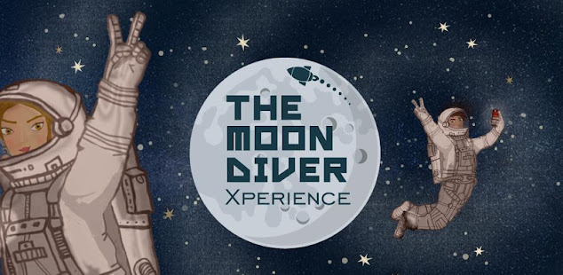
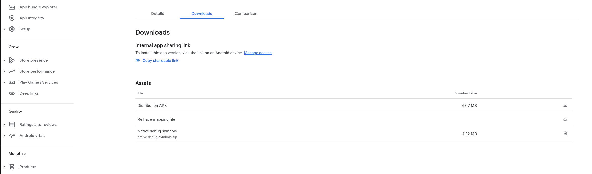

# The Moondiver Xperience - Educational Mobile Game

<hr>



[](https://opensource.org/licenses/Apache-2.0)
[](https://GitHub.com/scify)
[](https://github.com/dwyl/esta/issues)
[](https://GitHub.com/Naereen/StrapDown.js/graphs/commit-activity)
[](https://github.com/scify/the-moondiver-xperience-mobile-game/pulls)

<hr>

This project was created
using [LibGDX](https://github.com/libgdx/libgdx).

## About the game

"**The Moondiver Xperience**" is a knowledge game in Greek available for free
through [Google Play](https://play.google.com/store/apps/details?id=org.scify.moonwalker.game&hl=en) for Android
devices. It is
mostly addressed to Junior high school children and aims to motivate interest in astronomy in a playful way.
The game utilizes beautiful graphics (by illustrator **Lela Stroutsi**) and evocative sound and artfully mixes
fantastical
and real elements to create an extraordinary atmosphere.

What do the children learn?

The game develops skills and promotes knowledge and curiosity. It helps children learn about space and our solar
system (learn about the Sun and planets, and get a feel for the distances between them), understand the phases of the
Moon, learn of the first as well as the modern missions to the Moon, learn about meteors and comets, and realize how
unscientific theories (e.g. flat earth) are intelligently debunked.
In the puzzles, we emphasized understanding "orders of magnitude", to stimulate curiosity and admiration, not to dwell
on
dry detail.

The game helps them develop basic skills and calculations to drive their ship (understanding distance/engine performance
relationship), etc. They understand the need for cooperation of the international scientific community.
Perhaps it also helps in making them cast their eyes to the sky with a new look, full of curiosity…

## Project Setup

After cloning the project, follow these steps:

1. Copy the `config.properties` file from the Nextcloud folder to the `/android/assets/` directory.
2. Create a `local.properties` file at the root directory, with the information about Android SDK.
   Usually this file looks like this:

    ```bash
        ## This file must *NOT* be checked into Version Control Systems,
        # as it contains information specific to your local configuration.
        #
        # Location of the SDK. This is only used by Gradle.
        # For customization when using a Version Control System, please read the
        # header note.
        #Fri Sep 16 11:29:31 EEST 2022
        sdk.dir=/home/paul/Android/Sdk
    ```
3. Copy the `google-services.json` file to the `/android` directory.
4. If you are using Intellij, in the left explorer menu, left-click
   the `android/src/org/scify/moonwalker/app/AndroidLauncher.java` file, and select "Run
   AndroidLauncher".

## Build & sign for Android

Run:

```bash
./gradlew clean

./gradlew build
```

This will create both an unsigned debug APK file in the `android/build/outputs/apk/debug` directory,
and a release (unsigned though) .apk file in the `android/build/outputs/apk/release` directory. Before
you can install or publish this APK, you
must [sign it](https://developer.android.com/studio/publish/app-signing). The APK build by the above
command is already in release mode, you only need to follow the steps for keytool and jarsigner. You
can install this APK file on any Android device that
allows [installation from unknown sources](https://developer.android.com/distribute/marketing-tools/alternative-distribution#unknown-sources)
.

### Signing using Android Studio

The easiest and most convenient way is to produce the Android Bundle (aab) file, using Android Studio.
Select Build -> Generate Signed Bundle / APK
Select APK (and not Android App Bundle)

### Manual Signing

In order to sign the unsigned .apk, run:

```bash
cd android/build/outputs/apk/release

jarsigner -verbose -sigalg SHA1withRSA -digestalg SHA1 -keystore SciFY.keystore android-release-unsigned.apk SciFY

/home/paul/Android/Sdk/build-tools/32.0.0/zipalign -v 4 android-release-unsigned.apk android-release-signed.apk

/home/paul/Android/Sdk/build-tools/32.0.0/apksigner sign --ks SciFY.keystore --v1-signing-enabled true --v2-signing-enabled true android-release-signed.apk
```

Then, upload the `android-release-signed.apk` to the Google Play Developer Console.

## Deployment

This Application is deployed as a normal Android app.

When you upload a new version to the Play Store, make sure to update the version code and version name in the
`android/build.gradle` file.

Also, you will need to upload the mapping file, as well as the native symbols to Google Play Developer Console.

To do this, navigate to the "App Bundle Explorer" section of the Play Console, and click on the "Downloads" tab:



1. For the ReTrace mapping file, click on the "Upload" button and upload the mapping file that is generated by the build
   process. This file is located in the `android/build/outputs/mapping/release/mapping.txt` directory.
2. For the native symbols, navigate to the `android/build/app/intermediates/merged_native_libs/release/out/lib`
   directory, and create a .zip file (the name does not matter), which will contain these directories: `arm64-v8a`,
   `armeabi-v7a`, `x86_64`. Then, upload this .zip file to the Play Console.

## Contributing

Please see [CONTRIBUTING](CONTRIBUTING.md) for general details.

## Credits

- [SciFY Dev Team](https://github.com/scify)
- Lela Stroutsi (for the graphics)

## License

The Apache Licence. Please see the [Licence File](LICENCE.md) for more information.